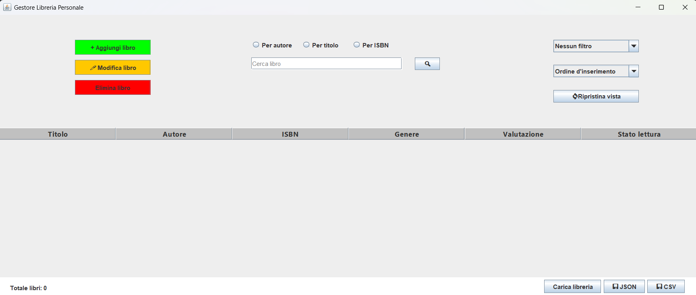
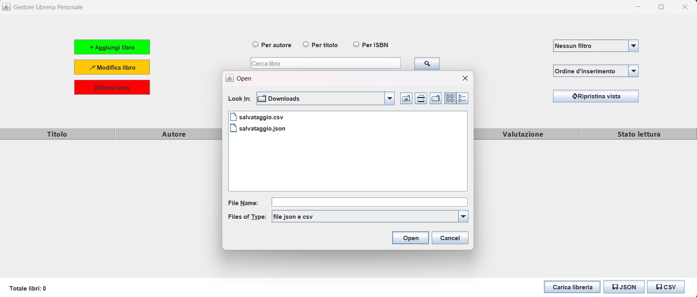
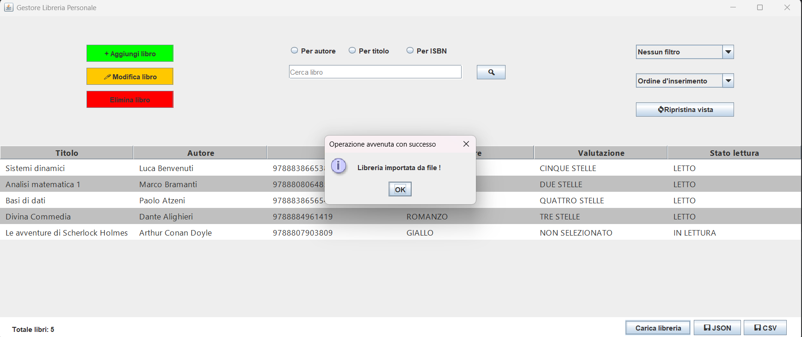
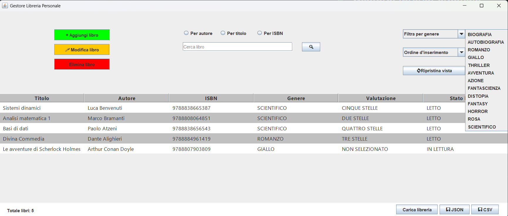
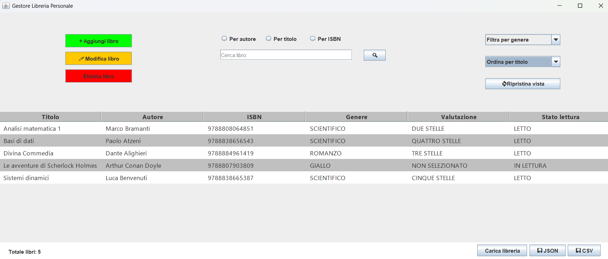
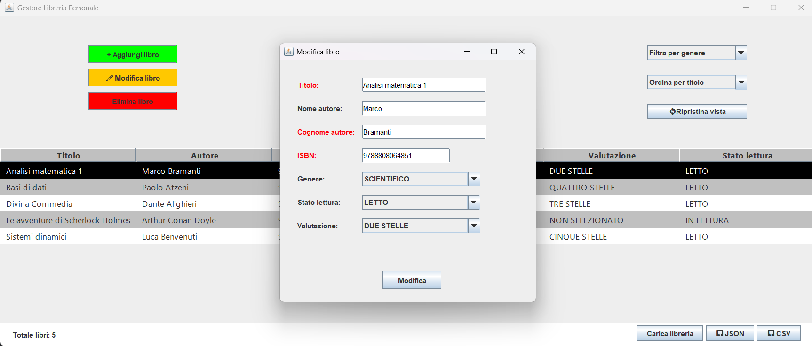

# GestoreLibreriaPersonale
Progetto relativo al corso di Ingegneria del Software, A.A. 2024/2025

## Descrizione
Implementazione in Java di un gestore per la libreria personale. Consente all'utente di effettuare le operazioni di
aggiunta, modifica, rimozione, ricerca, ordinamento e filtraggio dei libri.
Il salvataggio/ripristino su/dad file system vengono supportati nei formati JSON e CSV.

## Linguaggio
- Java 21.0.1

## Clone repository
git clone https://github.com/FPR10/GestoreLibreriaPersonale.git

## Screenshot
Si allegano alcuni screenshot, facenti riferimento all'applicazione in esecuzione:

## Relazione

## Info personali
- Francesco Pio Ruffo
- Matricola: 240044
- Email: rfffnc03h10d086z@studenti.unical.it

